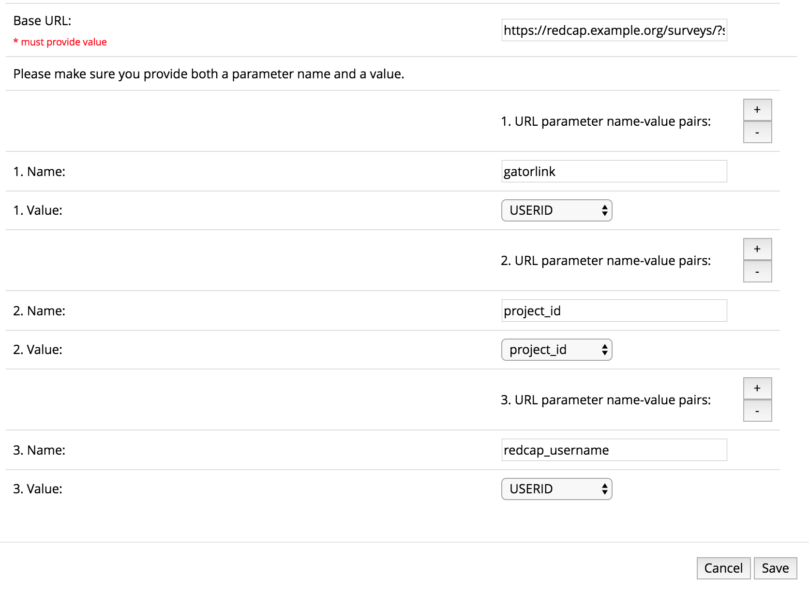

# REDCap External Module: Modify Contact Admin Button

Modify the behavior of the 'Contact REDCap Administrator' button by redirecting the user to a configurable url. The url should be provided as part of the external module configuration. A series of parameters may be added to the URL to make details about the current REDCap user and project available to the target form.

## Prerequisites

- REDCap >= 8.0.0 (for versions < 8.0.0, [REDCap Modules](https://github.com/vanderbilt/redcap-external-modules) is required).

## Installation

- Clone this repo into `<redcap-root>/modules/modify_contact_admin_button_v<version_number>`.
- Go to **Control Center > External Modules** and enable Modify Contact Admin Button.
- Still in **Control Center > External Modules** configure the module with a URL of a web form. You may also include parameter name-value pairs to be appended to the URL. For example, you could provide the URL of a REDCap survey used for service request intake. Lastly, activate this module for all projects.

## Features included

The following values may be selected to be appended to the URL:

- user_firstname
- user_lastname
- email
- project_id
- USERID

The `USERID` field contains the redcap username.

Settings on the system-level can be overridden for specific projects by super users only.

In addition, the label of the 'Contact REDCap administrator' button can be changed, and the button can be removed entirely.

## Example

Using the configuration below:

the rewritten target URL might look like this:

    https://redcap.example.org/surveys/?s=DUPrXGmx3L&gatorlink=jdoe&project_id=14&redcap_username=jdoe

To use the appended parameters, make sure the parameter names you chose coincide with the names of the fields in the target REDCap survey.
